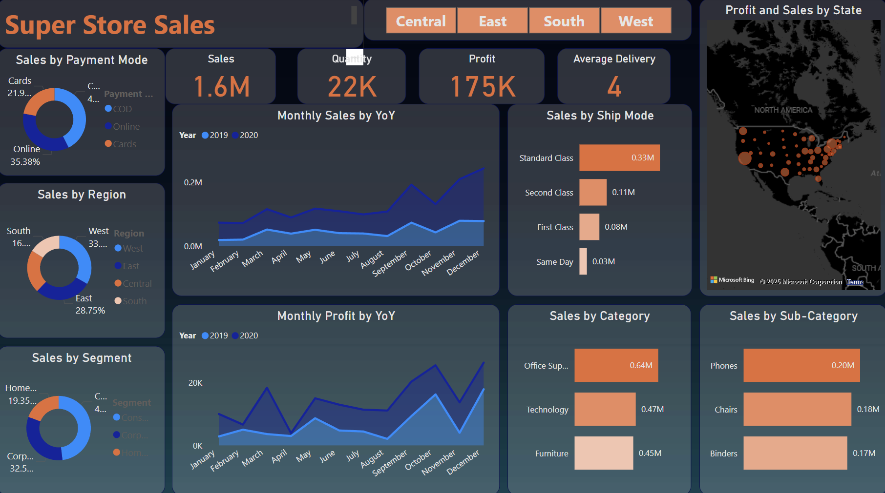

# Super Store Sales Analysis - Power BI Dashboard

## 📌 Project Overview
This project is a **Power BI dashboard** designed for **Super Store Sales Analysis**, providing key insights into sales performance, profitability, and trends. The dashboard visually represents data across multiple dimensions such as **time, region, category, and payment mode**, enabling data-driven decision-making for business strategy optimization.

## 🖼 Dashboard Screenshots
Below are the key visuals from the Power BI dashboard:

---

---

## 🔥 Features & Insights
- **Sales Performance Analysis**: Track sales trends over time with interactive line charts.
- **Profitability Metrics**: Analyze monthly profit comparisons to evaluate business growth.
- **Category & Sub-Category Sales**: Identify top-performing product categories and sub-categories.
- **Regional Sales Distribution**: Understand sales distribution by region with intuitive pie charts.
- **Payment Mode Insights**: Breakdown of sales by different payment methods.
- **Shipping Mode Analysis**: Evaluate sales performance based on different shipping methods.
- **State-Wise Sales & Profitability**: Visual geographic representation of sales and profit data.

## 🛠 Tech Stack
- **Power BI** for data visualization and dashboard creation
- **Microsoft Excel**
- **DAX (Data Analysis Expressions)** for data modeling and calculations
- **Power Query** for data transformation and ETL processes

## 📂 Dataset Details
The dataset used in this analysis includes:
- **Order Date, Sales, Profit, and Quantity**
- **Customer Segmentation (Consumer, Corporate, Home Office)**
- **Region & State-based Sales Information**
- **Shipping Methods & Payment Modes**
- **Product Categories & Sub-Categories**

## 📈 Key Business Insights
- **California has the highest sales volume (~0.34M), followed by New York and Texas.**
- **Technology and Office Supplies contribute the most to total sales.**
- **Standard shipping mode is the most preferred, generating the highest revenue.**
- **Online payments dominate, contributing to ~35% of sales.**
- **Sales and profit have shown an upward trend over time, with seasonal spikes in demand.**

## 🚀 How to Use
1. **Download the Power BI (.pbix) file** from the repository.
2. **Open in Power BI Desktop** (ensure Power BI is installed on your system).
3. **Refresh the dataset** to update data if necessary.
4. **Interact with the visuals** using slicers and filters for deep analysis.

## 🎯 Application & Use Cases
- **Business Strategy & Decision Making**
- **Sales Trend Forecasting**
- **Market Performance Analysis**
- **Customer & Product Insights**

## 👨‍💻 Author
**Satyam Kumar Chauhan**  
Passionate Data Analyst & UI/UX Expert  
📧 [satyamchauhan709@gmail.com]  
🔗 [https://www.linkedin.com/in/satyam-chauhan-87ba282bb/]  

---

